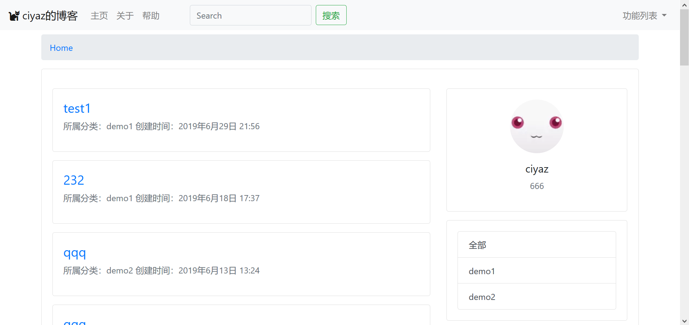
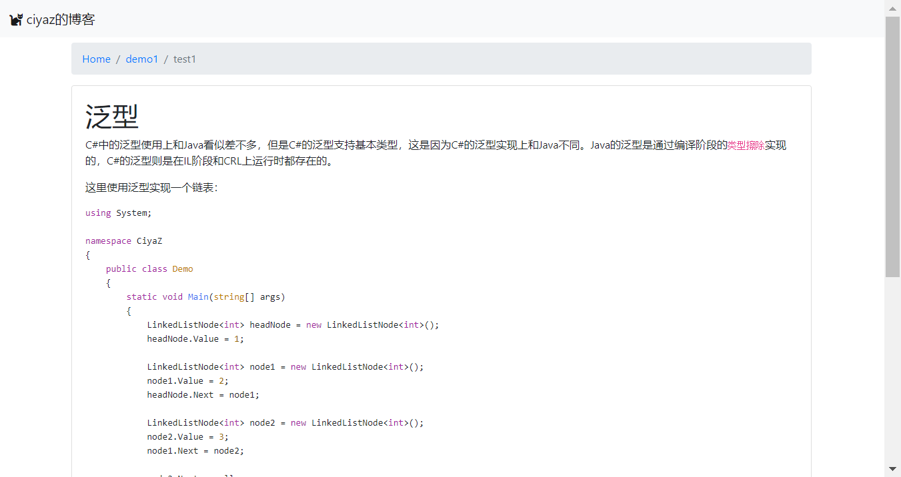
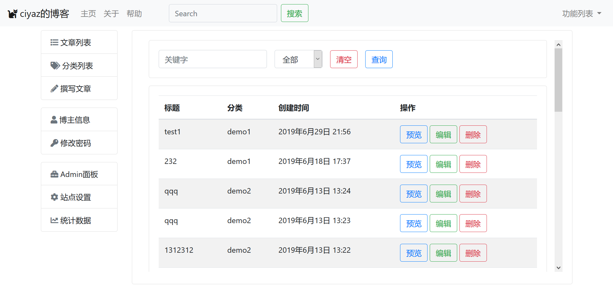

# blog

30分钟搭建的博客系统，基于Django2.2。







## 安装

部署服务器以UbuntuServer16.04为例，需要预先安装Python3（包括pip）、Nginx和MySQL，数据库也可替换为其它。注意MySQL需要`libmysqlclient-dev`这个包，可能需要单独安装。

### 下载代码

```
git clone https://github.com/CiyaZ/django-blog.git
```

### 安装Python依赖包

```
pip3 install django markdown mysqlclient uwsgi lxml
```

### 配置数据库

修改`blog/settings.py`中，`DATABASES`配置。如果使用的是MySQL，同时不要忘记创建一个数据库。

```sql
create database <数据库名> default charater set utf8mb4;
```

### 创建数据迁移

```
python3 manage.py makemigrations blog
python3 manage.py migrate
```

### 配置uwsgi

动态请求可以通过`uwsgi`处理。假设工程路径为`/home/ubuntu/blog`，部署到`8080`端口，编写以下配置：

```ini
[uwsgi]
chdir = /home/ubuntu/blog/
wsgi-file = /home/ubuntu/blog/blog/wsgi.py
processes = 4
threads = 2
http = 127.0.0.1:8080
daemonize = /var/log/uwsgi/blog.log
```

启动uwsgi服务：

```
sudo uwsgi --ini uwsgi.ini
```

### 配置Nginx

注意静态资源路径配置为`/static`，静态资源文件夹也为`static`，因此直接将`root`指定到工程根目录就行了。

```nginx
location / {
  proxy_pass http://127.0.0.1:8080;
}

location /static/ {
  root /home/ubuntu/blog/;
}
```

重载Nginx配置：

```
sudo nginx -t
sudo nginx -s reload
```

### 初始化

访问`/backend/install`地址，输入初始配置信息即可。访问`/backend/dashboard`地址，可以登入管理后台，初始化后会自动创建`测试分类`和一篇标题为`Hello, world!`的默认文章，可以直接删除。
